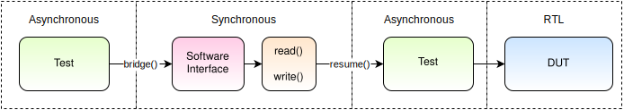

.. _coroutines:
.. _async_functions:

.. spelling:word-list::
   Async

********************
Coroutines and Tasks
********************

Testbenches built using cocotb use Python coroutines.
*Tasks* are cocotb objects that wrap coroutines
and are used to schedule concurrent execution of the testbench coroutines.

While active tasks are executing, the simulation is paused.
The coroutine uses the :keyword:`await` keyword to
block on another coroutine's execution or pass control of execution back to the
simulator, allowing simulation time to advance.

Typically coroutines :keyword:`await` a :class:`~cocotb.triggers.Trigger` object which
pauses the task, and indicates to the simulator some event which will cause the task to resume execution.
For example:

.. code-block:: python3

    async def wait_10ns():
        cocotb.log.info("About to wait for 10 ns")
        await Timer(10, units='ns')
        cocotb.log.info("Simulation time has advanced by 10 ns")

Coroutines may also :keyword:`await` on other coroutines:

.. code-block:: python3

    async def wait_100ns():
        for i in range(10):
            await wait_10ns()

Coroutines can :keyword:`return` a value, so that they can be used by other coroutines.

.. code-block:: python3

    async def get_signal(clk, signal):
        await RisingEdge(clk)
        return signal.value

    async def check_signal_changes(dut):
        first = await get_signal(dut.clk, dut.signal)
        second = await get_signal(dut.clk, dut.signal)
        assert first != second, "Signal did not change"

Concurrent Execution
====================

Coroutines can be scheduled for concurrent execution with :func:`~cocotb.start` and :func:`~cocotb.start_soon`.
These concurrently running coroutines are called :class:`~cocotb.task.Task`\ s.

The *async* function :func:`~cocotb.start` schedules the coroutine to be executed concurrently,
then yields control to allow the new task (and any other pending tasks) to run,
before resuming the calling task.

:func:`~cocotb.start_soon` schedules the coroutine for future execution,
after the calling task yields control.

.. code-block:: python3

    @cocotb.test()
    async def test_act_during_reset(dut):
        """While reset is active, toggle signals"""
        tb = uart_tb(dut)
        # "Clock" is a built in class for toggling a clock signal
        cocotb.start_soon(Clock(dut.clk, 1, units='ns').start())
        # reset_dut is a function -
        # part of the user-generated "uart_tb" class
        # run reset_dut immediately before continuing
        await cocotb.start(tb.reset_dut(dut.rstn, 20))

        await Timer(10, units='ns')
        print("Reset is still active: %d" % dut.rstn)
        await Timer(15, units='ns')
        print("Reset has gone inactive: %d" % dut.rstn)

Other tasks can be used in an :keyword:`await` statement to suspend the current task until the other task finishes.

.. code-block:: python3

    @cocotb.test()
    async def test_count_edge_cycles(dut, period_ns=1, clocks=6):
        cocotb.start_soon(Clock(dut.clk, period_ns, units='ns').start())
        await RisingEdge(dut.clk)

        timer = Timer(period_ns + 10, 'ns')
        task = cocotb.start_soon(count_edges_cycles(dut.clk, clocks))
        count = 0
        expect = clocks - 1

        while True:
            result = await First(timer, task)
            assert count <= expect, "Task didn't complete in expected time"
            if result is timer:
                dut._log.info("Count %d: Task still running" % count)
                count += 1
            else:
                break

Tasks can be killed before they complete,
forcing their completion before they would naturally end.

.. code-block:: python3

    @cocotb.test()
    async def test_different_clocks(dut):
        clk_1mhz   = Clock(dut.clk, 1.0, units='us')
        clk_250mhz = Clock(dut.clk, 4.0, units='ns')

        clk_gen = cocotb.start_soon(clk_1mhz.start())
        start_time_ns = get_sim_time(units='ns')
        await Timer(1, units='ns')
        await RisingEdge(dut.clk)
        edge_time_ns = get_sim_time(units='ns')
        assert isclose(edge_time_ns, start_time_ns + 1000.0), "Expected a period of 1 us"

        clk_gen.kill()  # kill clock coroutine here

        clk_gen = cocotb.start_soon(clk_250mhz.start())
        start_time_ns = get_sim_time(units='ns')
        await Timer(1, units='ns')
        await RisingEdge(dut.clk)
        edge_time_ns = get_sim_time(units='ns')
        assert isclose(edge_time_ns, start_time_ns + 4.0), "Expected a period of 4 ns"

.. versionchanged:: 1.4
    The ``cocotb.coroutine`` decorator is no longer necessary for ``async def`` coroutines.
    ``async def`` coroutines can be used, without the ``@cocotb.coroutine`` decorator, wherever decorated coroutines are accepted,
    including :keyword:`yield` statements and ``cocotb.fork`` (since replaced with :func:`~cocotb.start` and :func:`~cocotb.start_soon`).

.. versionchanged:: 1.6
    Added :func:`cocotb.start` and :func:`cocotb.start_soon` scheduling functions.

.. versionchanged:: 1.7
    Deprecated ``cocotb.fork``.

.. versionchanged:: 2.0
    Removed ``cocotb.fork``.

Async generators
================

In Python 3.6, a ``yield`` statement within an ``async`` function has a new
meaning (rather than being a ``SyntaxError``) which matches the typical meaning
of ``yield`` within regular Python code. It can be used to create a special
type of generator function that can be iterated with ``async for``:

.. code-block:: python3

    async def ten_samples_of(clk, signal):
        for i in range(10):
            await RisingEdge(clk)
            yield signal.value  # this means "send back to the for loop"

    @cocotb.test()
    async def test_samples_are_even(dut):
        async for sample in ten_samples_of(dut.clk, dut.signal):
            assert sample % 2 == 0

More details on this type of generator can be found in :pep:`525`.

Calling blocking code
=====================

When interacting with hardware components through a software interface, a software abstraction layer
or driver is typically responsible for communication.
This interface often relies on low-level register read/write functions, which are blocking operations.
This means they halt execution until the write completes or the read returns a result.

However, since cocotb operates using coroutines and is inherently asynchronous, these blocking
operations will prevent the simulator from advancing time, causing the read/write operations to
stall indefinitely.

To address this, cocotb provides two decorators: :func:`~cocotb.bridge` and :func:`~cocotb.resume`.

    - The :func:`~cocotb.bridge` decorator converts a regular (non-coroutine) function into a blocking coroutine by running it in a separate execution thread.
    - The :func:`~cocotb.resume` decorator enables a coroutine that consumes simulation time to be invoked by a regular thread.

A typical call sequence may look like this:

By using the :func:`~cocotb.bridge` decorator when calling a synchronous function inside the software
interface, a new excution thread is started where the synchronous code is executed.
When calling the read/write functions in the software interface, the corresponding coroutine must be
invoked using the :func:`~cocotb.resume` decorator.
This approach allows the synchronous code to block in a separate thread while permitting the simulator
to continue advancing time.

The following code snippet demonstrates in a simple example how to do register read and write
operations within cocotb from a synchronous conext:

.. code-block:: python3

    import cocotb
    from cocotb.triggers import Timer
    from cocotb.clock import Clock

    async def async_read(dut):
        """Read the register of the DUT."""

        return dut.register_out.value

    async def async_write(dut, value):
        """Write the register of the DUT."""

        dut.write_enable.value = 1
        dut.register_in.value = value
        await Timer(2, units="ns") # wait at least one clock period
        dut.write_enable.value = 0

    def sync_read(dut):
        """Go back into the asynchronous context and read the register."""

        return cocotb.resume(async_read)(dut)

    def sync_write(dut, value):
        """Go back into the asynchronous context and write the register."""

        return cocotb.resume(async_write)(dut, value)

    @cocotb.test()
    async def test_synchronous_register_access(dut):
        await cocotb.start(Clock(dut.clk, 1, units='ns').start())

        write = random.randint(0, 255)
        await cocotb.bridge(sync_write)(dut, write) # call synchronous function by using bridge()
        await Timer(2, units="ns") # wait for the output of the register to toggle
        result = await cocotb.bridge(sync_read)(dut)
        assert write == result, f"read value {result} is not the written value {write}!"

.. versionchanged:: 2.0
    :func:`cocotb.bridge` renamed from ``cocotb.external``, :func:`cocotb.resume` renamed from ``cocotb.function``.

.. _yield-syntax:

Generator-based coroutines
==========================

.. versionchanged:: 2.0
    This style, which used the ``cocotb.coroutine`` decorator and the ``yield`` syntax, was removed.
